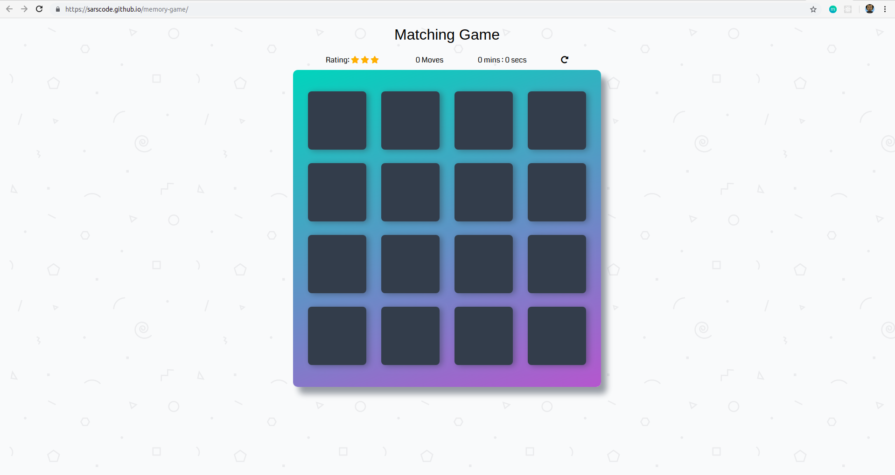
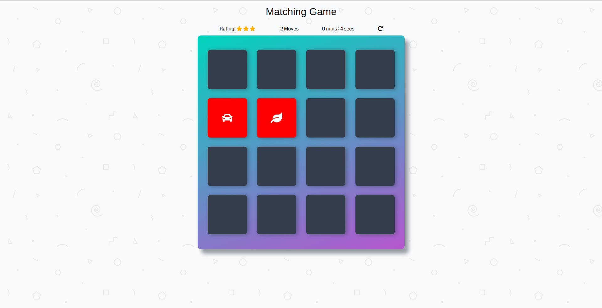
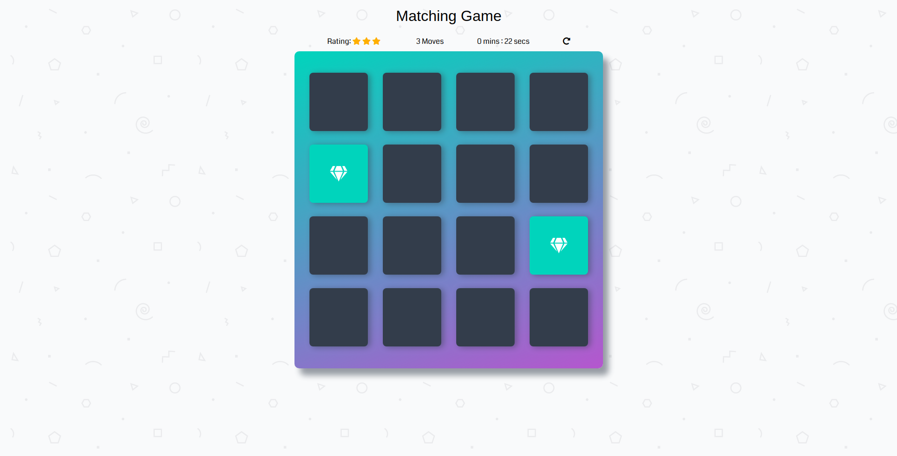
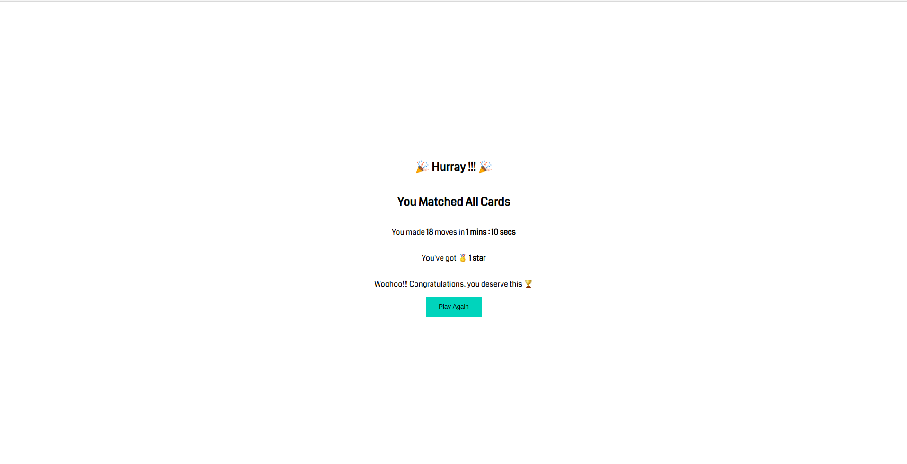

# Memory Game

The Memory Game is a web-based application that runs on the browser.
The game test a user's short term memory by engaging in making

## How To Play

The game board consists of sixteen cards arranged in a grid. The deck is made up of eight different pairs of cards, each with different icons on one side. The cards are arranged randomly on the grid with the symbol face down.
Click on a card to show it hidden content, make a guess and click on another card to match the already opened card.
If cards are matched, they stay open.
To successfully complete the game you have to ensure all cards on the deck are matched.

You can play the game [here](https://sarscode.github.io/memory-game/) or download/clone the repo and open _index.html_.

## Screenshots

- Game Play
  
- Unmatched Unmatched
  
- Matched Cards
  
- Completed
  
